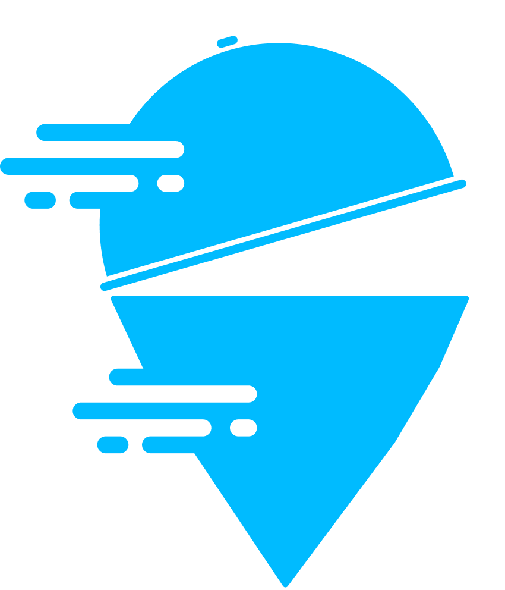

# Foody

<!-- ABOUT THE PROJECT -->
<p align="center">
  <a href="#" target="_blank"></a>
</p>

Aplikasi Foody adalah Aplikasi iOS Pemesanan Makanan dengan SwiftUI, WidgetKit, Google Fonts, dan Assets dari Figma untuk Mempelajari Ilmu Frontend iOS.

### Preview
<p align="center">
  <a href="#" target="_blank"></a>
  <a href="#" target="_blank"></a>
  <a href="#" target="_blank"></a>
</p>

<!-- ABOUT THE FILE & FOLDER STRUCTURE -->
## Folder & File Structure
Berikut struktur file dan folder pada iReader:

    .
    ├── FoodyApp.swift          # Root Project: Konfigurasi ContentView
    ├── Info.plist              # Fonts Provided by Aplication: Poppins-(Regular, Medium, SemiBold, dan Bold)
    ├── ContentView.swift       # Tampilan Beranda Aplikasi
    ├── Assets                  # Aset Logo, Icon, Gambar, dan Warna
    ├── GetStartedView.swift    # Berisikan Halaman Get Started (Frontend Only)
    ├── HomeView.swift          # Berisikan Halaman Home / Beranda (Frontend Only)
    ├── DetailView.swift        # Berisikan Halaman Food Detail (Frontend Only)
    └── OrderView.swift         # Berisikan Halaman Order (Frontend Only)

<!-- List of Features -->
## Features:

* Widgets & Properties
* Basic Navigations with Group & onTapGesture
* Declarative UI with @State
* Importation Assets from Figma & Google Fonts

<!-- Used Tools -->
## Build With:

* [Swift](https://www.swift.org/documentation/)
* [SwiftUI](https://developer.apple.com/documentation/swiftui/)
* [Xcode](https://developer.apple.com/xcode/)

<!-- How to Install -->
## Installation
Untuk menggunakan repositori ini, ikutilah petunjuk penggunaan berikut dan pastikan git sudah terinstall pada komputer (semua perintah dilaksanakan pada `cmd.exe` atau `terminal`):

1. Lakukan download .zip atau `clone` repositori dengan cara:
```bash
git clone https://github.com/dekapd99/Foody.git
```

2. Jika sudah silahkan buka Project di Xcode.
3. Pastikan untuk memilih iPhone pada Target Simulator (Kolom Device dibagian atas Xcode). 
4. Build & Run

<!-- What Kind of License? -->
## License
MIT License: Copyright (c) 2022 DK

<p align="right">(<a href="#top">back to top</a>)</p>
